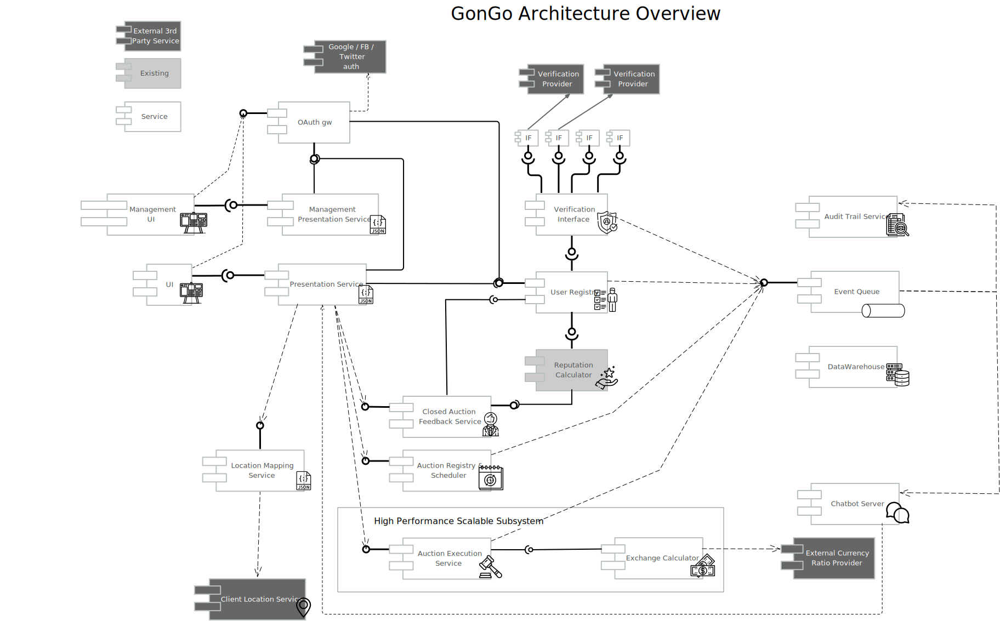

= Shoppomatic GonGo Proposed Architecture
:version: 1.0.1-SNAPSHOT
:imagesdir: images

Version: {version}

== Introduction

Shoppomatic — a big e-commerce company that runs online c2c shopping platform (usually it's second-hand and used goods).
They are planning to expand their business by creating new trading opportunities for the platform audience — online
auction portal "GonGo". This document is the architecture design for the proposed application.

== General considerations

=== Users

The users of the application are verified. This assumes that there is a verification process. The stage of the process
has to be reflected in the structure of the user data structure, and the architecture should accommodate the
verification process optionally including third party actors, who may deliver services verifying the identity of certain
users.

=== User Verifier

Some external entity that verifies that a certain person solely bearing the information used for their authentication
has certain and verified external parameters. In layman terms, they have their real name, address etc. as it was
registered and is stored in the auction system. There may be more than one cerifiers who may verify different set of
parameters, and their verification may provide different verification strength.

=== Money Exchange Provider

An external actor may provide exchange rate between different currencies. Currency exchange rates are continuously
changing and thus allowing bids in different exchange rates introduce uncertainty. The auctioned good price is fixed
in a certain currency, and a bid in a different currency must be exchanged to the auction currency. The exchange can
happen at different times.

- at the time of the bidding
- at the time the auction is closed
- at the time of the money transfer

The exchange rate is likely be different between these times. The difference between the different exchange rates may
mean different advantages to different actors in the process.

== General Architecture

        ACT: user schedules auction
        ACT: user apply for scheduled auction
        PROCESS: auction discovery
        PROCESS: auction categorization (assumed actor: user)
        PROCESS: money exchange
        PROCESS: reputation calculation
        ENTITY: auction
          can be scheduled or non-scheduled
          has parameters/options
        ENTITY: auction discovery registry
        ENTITY: user reputation calculator and store
        ENTITY: deal history
        ENTITY: auction has enabled/ disabled regions
        ENTITY: country / region registry
        ENTITY: statistics calculator and store
        ENTITY: chat server service
        ENTITY: allied external bid service
        ENTITY: audit archive

==

=== Project Activities Recent (nine) years, EPAM

I work as a senior Java developer many times taking the role of the architect in different EPAM projects. These projects
last usually a few years and I list the past below. I usually play the role of the lead developer, many times as a scrum
master and/or architect. During this work I enhanced my Java knowledge and to develop the community I wrote more than
a hundred blog articles, articles in printed magazines, I created video tutorials, trainings in EPAM and books.

2011-2013 EPAM Systems Hungary Coke project delivering customer-facing user engagement application

2013- EPAM  Systems Switzerland, 7 years in UBS bank in Investment Banking and Wealth Management

==== 2013 FX Renewal Project application utilizing GWT

image::fx.svg[role="left"]

This project aimed at the replacement of an IBM mainframe application in the UBS bank utilizing homegrown Java
applications and the ORACLE database as background technology. The major goal of the development was to decrease the
running cost of the application, which was high because of the IBM CPU cycle based invoicing. The project utilized more
than 200 developers for three years and reached a maturity level that it became inevitable that the development will be
a success and will be able to replace the old mainframe-based solution. At that point, IBM lowered their price to the
level so that it was not economically viable to advance further the new development. The project was stopped and the
developers were reallocated to other projects. Although it was frustrating to stop on a project that had such a great
human investment the project itself was successful from the business point of view and reached the goal: the cost was
reduced.

As a fresh person in Switzerland, I joined the development one year before its abortion. I acted as a senior but not a
lead developer in a team that consisted of three senior developers (including me), a junior, a business analyst and a
tester. The project management was remote in the USA. The technology of the project was dictated by earlier established
architectural decisions, which, in light of the final outcome, were actually perfect though questionable from the
technical point of view. The developed front-end application was developed using Google Windowing Toolkit and it was
communicating with the back-end using a proprietary HTTP/1.1 based XML formatted protocol.

==== 2014 Client Advisor Workbench (CAWB) development using Java Servlet and XLS based menu configuration

image::cawb.svg[role="left"]

As the previous project came to a strong halt and after one month of bench I was assigned to a project that was running
in the Wealth Management branch of UBS. This project was more of a maintenance than a development project. The
application was a framework for managing a web UI menu system. The structure of the menu was described in an Excel
table. The different menu items were representing different URLs that could get optional parameters provided by other
components. The different menu items' availability was controlled by user rights, location, and other parameters.

During the maintenance old application were re-configured to follow functionality change, new applications were inserted
as new menu items. This needed the modification of the XLS table and testing. Some integration patterns also needed some
Java coding, which was not too complex but it essentially was hacking in the framework as there was no clear interface
for these integrations defined. The documentation of the XLS table structure was also lacking documentation and some of
the columns' functionality was only known from experiments. The menu system XLS was transformed into a huge XML based
structure that was created using a serialization framework. That way the structure of the XML was overly complex and
more following the serialization logic of the serialization framework used than the menu structure.

There were approximately five developers modifying the XLS file during maintenance. At the time it was not possible to
concurrently modify an XLS file (as it is questionably but available using Teams). The choking point of the development
was that only one developer could modify the XLS table at a time. This was not an ideal position and it was leading to a
demanding need for a change to find some better solution that I participated two years later.

==== 2015 CAWB client search functionality

image::cawbcs.svg[role="left"]

One main functionality of the Client Advisor Workbench was search. The advisors could search for a client using name,
birth date stamm number (account number) and other parameters. The goal of the development in 2015 was to introduce new
functionality and extend the search capabilities. The Java front-end application used SOAP and the UBS proprietary,
so-called MAP SSP protocol to communicate with the back-end that could perform the actual search. The front-end used
JSP, Java servlet, JQuery, JavaScript and generic Java.

There were two developers on this project. One of the developers was the UBS employee, who developed the application for
many years, although he was not the original author but had significant knowledge about the application. The other one
was I.

After the first week analysis of the code, it was evident that the code base is extremely rigid and not state-of-the-art.
There were no unit tests at all. There were several classes with more than 1000 lines. There was a 5000 line class that
I could split into three classes without analyzing the actual functionality simply collecting the methods and fields
into three groups so that a method in a group was using only the members in the group and not from the others. Later,
during the code analysis, I could also isolate methods that were not explicitly referenced and thus the static code
analysis signaled them as not used. I also executed a full-text search to find reflective use. Still, when I deleted them
the code stopped working. The further manual analysis revealed that they were invoked from a JSP page composing the name of
the methods from smaller string segments and using reflection to execute the actual call.

I could convince the other developer and also the management to allocate 40% of the project to refactoring and devote
only 60% of the development to new features. We cleaned the code gradually, introduced the use of Sonar on the CI server
and we created unit tests. After one year the code coverage of the unit tests was 17% and the number of QA discovered
bugs significantly decreased.

===== SWAT-ting Montel Ltd. Application, 2015

image::swat.svg[role="left"]

Montel developed an application that recorded the voice of the telephone conversations of the agents of the company for
quality assurance. The application connected to CISCO equipment and used voice over IP catching each packet representing
voice. The application was already in production at many customer sites and functioned well when they had their first
installation in the UK. The application in the UK installation crashed a few minutes after the start. I was personally
asked to help to rectify the reason and help to create a fix.

It was not a commercial activity. I helped an old friend during a three-day weekend when I traveled to Hungary. The case
was extremely important for them as this was the first installation and they wanted to use this as a reference.

The application was implemented in C++ that I had no experience with, but C++ is just another language, and I had
experience in C. I have learned that the communication between the application and the CISCO appliance was TCP/IP. The
content of the transfer was in consecutive XML formatted messages. The code read from the TCP channel as much as was
available and then it analyzed the XML structure.

The application tried to find the end of the meaningful data in the packet received searching for the closing `</tag>`
that signaled the end of the package. If it was not found then it knew that it had to read another package. At the same
time, the first two bytes of the stream contained the length of the message. According to some comments in the code,
this value was unreliable, and that was the reason why the application tried to find the end tag.

What really happened was that the application worked fine with the setting of the CISCO appliance that resulted in
messages that were shorter than 1,500 bytes and thus fitting into one Ethernet package. More than 1000 installation
prior to the one in the UK was like that. When they were longer then sometimes it happened that the end of the XML was
just finished in the first package (or at the end of some later package) and the CR and NL characters after it was
coming in the next package. In that case, the program just ignored the lack of the and of line characters and treated
the XML as full. There was even a comment that said that these characters are sometimes missing from the message.
However, in these cases, the next package length was read as 0x0D0A bytes because in reality that was the CR and LF
characters. There was also a comment, and a "fix" to skip that extra two bytes (the real length) that were "sometimes"
there.

The fix of the application was not simple as there was no time to rewrite the whole application separating the different
application transport layers. What we had to do was to create a minimal safe fix in a language that only one of us, the
one being the directory of Montel that time and thus having less actual commercial development experience, knew. I was
and am really a novice in C++.

The fix was created and following this, VVSC, where I was not an owner or active participant at the time, was
asked to implement a development environment introducing gradually version control, continuous integration, ticket
handling using JIRA, release management. A large part of the application was also migrated to Java from C++ during this
period.

==== 2016 Pilot project to replace the CAWB XLS configuration with Groovy DSL solution

image::xls.svg[role="left"]

Because of the shortcomings of the XLS based configuration management of the CAWB workbench menu system, there was a
need to create something more flexible. The original idea to use XLS was driven by the idea that XLS can be edited by
BAs or business people. This was a total failure since the configuration contained such technical details that they
could be edited by developers and the modified configuration needed manual testing. At the same time, the XLS was not
supporting concurrent modification and that way checking out the one single file for modification, making the
modification and then checking it in again became the bottleneck. It was especially hurtful when someone forgot to check
in the modifications after the modification.

During 2016 I prepared a proposal to create a new solution that maintains the menu structure in text files just like
program source code utilizing a domain-specific language (DSL). We suggested the use of the Groovy language. Groovy is
designed to create DSLs in addition to be a general-purpose language running on the JVM. That way there was no need to
implement a parser for the DSL and any interpreting execution environment. A Groovy DSL is a full-blown DLS and at the
same time, it is still Groovy that can directly be handled by the Groovy interpreter. That way a Groovy DSL is
essentially creating some Groovy libraries defining some metaclasses.

The proposal contained draft sample code, development cost estimation, project time scale, milestones of the gradual
development, defined quick win and also estimation about the later running cost that was projected to be significantly
lower than the current cost using the XLS format. The proposal was accepted to execute a pilot aiming for the quick win
results and we could also get UBS wide permission to use Groovy as an approved language in the development environment.

The pilot was to get a subset of the DSL defined and implemented so that it can be converted to comma-separated values
that were read by the original build tool creating the complex XML structures. This essentially introduced another
format and conversion in front of the conversion lines. This was not a clean architecture, but at the same time, it was
never meant to be a final solution. Later phases of development in the plan had the goal to replace the XML based
persistence layer in the framework into something simpler, perhaps still XML or YAML, which is directly generated from
the DSL.

I designed the DSL and programmed the Groovy implementation with another senior coworker who was working with my lead.

After the successful pilot, the project financing was delayed and I started other projects. Later the project was
financed with a seriously cut budget. The so-far final, which is still in use uses XML format files that are edited by
the developers. These are converted to a single CSV, which is then converted to the complex serialization library XML
format. This solves the major problem of the single point of editing but does not deliver the "macro" possibilities to
eliminate similar configuration item copy/paste editing. I was not part of this second part.

==== 2017 eBanking sales offering application.

image::webshop.svg[role="left"]

UBS has renewed the UI of the internet banking application in the years before 2017 and at this point, it became evident
that the further development and maintenance of the application cannot be performed using a monolithic Java
servlet/Spring MVC, JSP, jQuery architecture. A solution was made to implement an architecture that separates the
presentation services and the UI. The presentation services collect and enrich data using the business services usually
available via SOAP calls to deliver data that are to be presented to the user to the UI application using REST services
in JSON format. The presentation services were to be developed using REST maturity level 3.footnote:[ REST services
Richardson Maturity Model https://martinfowler.com/articles/richardsonMaturityModel.html] The Hypertext Application
Language (HAL) based local UBS standard is named AIF and is in use recently.

For UI technology, a team was appointed to research the available frameworks and select one as the recommended
framework. There were 5 UI developers, one API architect in the team and I was appointed as the technical lead. I
suggested the methodology to select the technology candidates, the way to evaluate the different candidate frameworks
and finally I created the document with the suggestion for the decision-makers, the UBS chief IT architects. The
suggested decision was accepted and to-day the bank uses primarily React.js as their UI framework. Later Angular, also
evaluated in the process, was added as a secondary accepted framework.

After this one-month research project, we started the development of the Sales and Offerings (SAOS) module of the
eBanking application. This was the first AIF based module of the eBanking application. I was appointed as solution
architect and it was my responsibility to map the functionality of the application to the modules to be developed, the
connections and integrations to other banking systems and to document the solution architecture to the level that it is
understood and accepted by the chief architects and can also be used as a working document during the development. The
document was accepted with comments but without requiring any modifications. I also participated in the development of
the application as an architect discussing the details of the integrations that are one level below the architecture and
guiding the 8 member development team to develop a solution that fits the envisioned and approved architecture.

==== 2018 FormGenerator project

image::form.svg[role="left"]

The application was a greenfield development of a simple AIF (see above) compliant presentation service that groomed
the data sourced from a few MAP SSP services. The functionality of the application was to support the client advisors to
select the needed printed forms for new client onboarding, especially in the ASEA region. The regulation on the needed
documents is very complex and the new clients live usually in long-distance and thus it is difficult to amend a missing
document. At the same time, these clients are usually more than one million dollar net worth. Therefore it is
important to avoid human mistake, especially forgetting a form that is needed to be filled it. In extreme cases, it may
result in the loss of a prospective client who already was in the bank filial office.

On the project, there were two senior developers. I was the appointed lead developer and architect. I created the
Software Architecture Document (SAD), which was approved by the UBS CTOs.footnote:[Proven Designs: 2017 eBanking sales
offering application, 2018 FormGenerator project, 2019 Client Risk Categorization] We developed the product in less than
a year following agile methodology, having practically 100% code coverage. Only IDE generated setters and getters were
not covered. The application got into production until there was no more needed functionality.

The afterlife of the application was a bit interesting since there was no-one assigned to the project as a developer
and that way the bank lost the L3 support people and also the knowledge. It was no a non-recoverable loss because we
have created the knowledge base of the application along with the SAD, but there was no personnel who knew the
application on L3 level from one day to the other. We notified the project management at the end of the project of the
situation but still, there was no budget allocated to keep the support up. Luckily the application quality was good
enough. There was one incident one and a half years later that I tried to solve but before I could refresh my memory
based on the documentation we created, the bug turned out to be and it was solved in the back-end.

==== 2019 Client Risk Categorization

image::risk.svg[role="left"]

The client risk assessment project was aiming at the in-sourcing an already existing application. The application was
developed by UBS personnel originally starting as early as the year 2000. Later the application was handed over to IBM
to perform maintenance. During the two years of development, the tasks and responsibilities were taken over from the IBM
developers and into the hand of EPAM developers. At the start of the project, I was the only non-IBM developer on the
project. Later, when the budget supporting the IBM personnel was transformed to cover in-sourced resources I could
reference and suggest our former EPAM coworker whom I was working with on the forms generator project. This was an
interesting business proposal because the original in-sourcing project became sourced to EPAM developers.

The technology of the code was a proprietary framework developer in the, and around the year a.d. 2000. That time there
were not that many web frameworks. The development of the framework aimed to have a wide market and thus the framework
has many configurable functionalities. The framework is used only in this application and as a result, it has a huge
configuration overhead. At the same time, the framework is as well documented as well the source code lacking any
JavaDoc can document (a.k.a. no documentation whatsoever).

The framework is based on the usual HTTP request/response workflow and defines several layers. The lowest layer is
accessing background services and creates a String represented XML structure from the different back-end service
answers. This XML, which was created by the program itself is parsed again before applying an XSLT transformation to get
the almost final HTML output to be sent as a response. The created HTML was also enriched in some cases with reference
data, like the list of countries, list of currencies that are not client-specific and more or less constant but must be
sourced from the reference database.

The application referenced several libraries. 30% of these libraries were not used and there were approximately five
libraries where there were version conflicts between the different transitive dependencies. Just to name two
anomalies: JUNIT 3.8 was a compile-time dependency. Note that this library is to be used only during tests and the
version was 12 years old with 28 newer releases even before JUnit5 was released.

The application has approximately 60,000 lines of source code (plus the "framework" for which neither documentation nor
source code was available).

Even though we started to create unit tests for the application the expunging of the excess libraries was cumbersome.
When a suspect excess library was removed we had to compile the application and manually test that the application is
still working. In some cases the compilation failed, eventually showing the library is in use somewhere. In other cases,
we had to wait the 10 minutes compilation time and 5 minutes of startup time before starting the tests. Essentially this
made the elimination of the excess libraries to a speed of one per day accounting for the time the libraries that could
not be removed consumed.

We also sped up the compilation time removing unnecessary phases and we also decreased the startup time eliminating the
fill-up of local reference data cache that consumed most of the startup time. It resulted in slower execution as the
data was not preloaded into the memory, but the change was effective only in the development environment and in that
environment, the speed was not that crucial.

Because the different XSLT templates were including each other and the structure of the inclusion and the dependency of
the different templates were not documented the modification of the UI was extremely difficult if we wanted to keep the
logic of the code structure. Once it took two days for two developers to insert a new field into an existing page. It
was obvious that the maintenance of the application will come to a halt in a few years.

I created a report as a working document about the technical debt of the application and after six months working on the
project, the management decided to give it a go and to start the renewal of the application. This work aimed at a
solution that builds on the existing code as much as it makes sense but the front-end is to be replaced to modern
React.js based and the Java part should deliver the information to the client using the REST level 3 following the AIF
guidelines.

I created a document that envisioned a three-step approach,

* starting with a PoC including quick win results,
* major refactoring of individual screens transforming each screen to React.js on the UI and REST on the server
* final clean-up and elimination of remaining technical depth.

The second phase was designed in a way that it could deliver working releases after the refactoring of each screen and
the new and old technology screens were able to work together. The project was started and I implemented the PoC part
including the quick win results. This essentially channeled off the data from the original flow in case the HTTP request
had an `accept` header signaling that it can work with JSON. In such a case the data was converted to JSON and delivered
to the client application instead of converting to XML and applying the XSLT transformation. This resulted in a JSON
response that contained all the needed data, however, it was not AIF compliant.

Based on the result of the PoC the plans were refined and the second phase started in 2020 with three-month delay after
I was assigned to my next project.

==== 2019 Tax reporting application pilot

image::tax.svg[role="left"]

The tax reporting project was a proof of concept project. The business area is the report documents that the bank has to
send to the tax offices in the different countries about the account status of different clients of the bank. The
account status includes not only the money accounts but also stock and other accounts. The process of reports starts
extracting, filtering and aggregating the data from the banking systems. This raw data then enriched manually when
needed. One example is when there is a company merger or company name change. In this case, the bank systems are not
interested in the connection of the position history. The only interesting thing is the position of the account. On the
other hand, the tax offices need to be able to pair buying and selling transactions so that they can calculate, check
the tax claims. Because each country has different taxation law the raw data is sent to third parties who enrich the raw
data and create the reports according to the national tax office requirements.

A prior analysis revealed that there is a huge part of the enrichment process, which is the same for all different
countries. This part is implemented by third parties in their own way and it drives the cost of their service. A
better solution would be to implement the common part centrally, preferably outsource the mechanical manual work to
off-shore country and ask the third parties to perform only the country-specific work.

The proof of concept phase had to analyze the different data sources available in the bank to prove that the common part
of the task can be implemented centrally. It also had to implement a demo application that shows one or two enrichment
tasks out of the 40 different identified possibilities (company name change or mergers are one).

During the three month PoC period I had to analyze the data sources, document the different data tables and fields. I
created a Software Architecture Document for the PoC in a manner that the document could be developed further to be
full-blown SAD for the final application. I suggested the technology stack to be Java, Spring on the front-end, and
React.js with TypeScript on the UI. The proposed back-end application was also envisioned as Java with a DB2 database,
which was a precondition as the data source is stored in DB2.

At half of the PoC an EPAM team of UI developers joined the project and I handed over the UI development to them. At
the end of the PoC, I have delivered the FE application and a sample UI. The documentation and the analysis of the data
source were accepted and the PoC was declared successful and the development of the application has started.

==== 2020 Swiss Re Data Compliance Consultancy

image::swissre.svg[role="left"]

During January and February 2020 I participated in the expert group of four EPAM employees to assess the compliance of
the data handling of Swiss Re in their new P&C application suite. The team consisted of a BA, a data compliance expert,
a project manager and me, as the solution architect. The different applications that we analyzed from the
data-management point of view are written in Go language and in Python. The development and operation run on Microsoft
Azure.

During the analysis of the development and operation practices, we identified nine major gaps to be fixed. They were
composed as seven suggestions to the client. In summary, we had to formulate the recommendations so that the
statements about the gaps are not interfering with internal organizational structures and lines of interests. The
delivery of the findings was in the form of presentation in addition to the written form and it was also repeated in
front of a wider audience so that the work became known by other Swiss Re organizations. The follow-up was consecutive
contracts aiming to eliminate the gaps as well as to discover similar gaps in other organizations of Swiss Re.

==== 2020 Swiss Re Cloud Service Consumption Analysis

image::spark.svg[role="left"]

Starting with March 2020 I participated Swiss Re in a new project that aims to analyze the computing resources
utilizing Azure, Swisscom and other cloud providers used in Swiss Re. The analysis gets the consumption data directly
from the providers or the internal Data Warehouse (DWH) application when the DWH has already collects the data on a
daily basis and the coompleteness of the data is sufficient. The project

* collects the data via DB connection or using rest services
* cleanses the data so that data structure match the ontology of the project no matter which cloud provider provided the
  the data
* transforms the data for the analysis
* displays the data in different ways that match the analysis needs

In addititon to analysis the structure also supports budgeting and planned data, which needs data entry application used
by the different department IT organizations that plan and use cloud resources. The analysis also compares the planned
vs. actually used resource.

The technology used for the data management is the Palatir commercial project. In short (and as hort is usually not
precise), Palantir is a userfriendly UI oriented application that provides an interface towards the underlying Apache
Spark / Apache Hadoop technology. It provides ready made drag and drop / point and click solutions for many of the data
visualization and transformation tasks. These functions are reachable through a Web user interface.

Transformations that are not trivial have to be programmed in Scala, Python or in Java, which are the natively supported
languages by Apache Spark. The application provides online editing, running and debugging on the Web UI for the Python
language.

My role in the team was to develop the Python code for the different transformations using the Pyspark library. I made
the decision to use Python because that is the language most supported on the platform. The available tutorials and
documentation sources that are available free also seem to be tremedous.

The project at the moment of this writing is ongoing.

=== Project Activities 2006 - 2011 VVSC Ltd.

image::vvsc.svg[role="left"]

During these years I was CEO and owner of a two-person company VVSC Ltd. in Hungary. The main area of the company was
Java software development. We were focusing on test automation. Here I list the major projects from this period.

==== Advertisement Engine to T-Mobile Online Shop

image::ad.svg[role="left"]

Having a reference as the developer who has created the Index.hu AdEngine (see below) our company could get the project
to develop the advertisement engine for the online shop of T-Mobile. The advertisement, in this case, was a bit different
from other media, because the user was already in a shopping process and the goal of the advertisement was not to lure
the user away from the page but rather to extend his shopping activity.

The application was developed in Java, Hibernate, ORACLE database, and the ORACLE Application server. The advertisement
selection algorithm was started on an asynchronous thread for each hit and in case it has not finished within 2 seconds
the HTTP request was responded with a preconfigured and not fine-tuned offer.

We had a lot of trouble during the first few weeks of the production because the application died during heavy load and
could not recover. This meant that the application had to be restarted every few hours. A two-week analysis revealed
that during heavy load the asynchronous threads did not finish and the database connections these threads were using
were not released when the application forcefully killed the threads. The discovery of this behavior was hardened by
the fact that the ORACLE documentation explicitly mentioned that the handlers were to be released and their connection
pool software library even created a log stating that the handle was released. It just did not.

The advertisement software was in use for two years and got replaced when an off-the-shelf product replaced the whole
T-Mobile online shop.

==== Electronic Invoice Signature Application

image::signature.svg[role="left"]

T-Mobile Hungary needed a solution that could apply digital signature on all the invoices (monthly invoices and invoices
created in shops selling subscriptions and mobile phones) so that they could avoid the storage of the paper version of
the invoices. The appliance that could create the signature had an HTTP interface to upload the document to be signed
and then to download the signed and time-stamped document. The appliance was safe and secure and hardware hardened to be
started up using two independent cards to load the private key from. On the other hand, if it was "attacked" using an
HTTP request with a document before the previous one was finished then the appliance stopped working and needed a
reboot. The signature and timestamp creation could also fail when the connection to the time-stamping server was not
reliable. In such a  situation the document was only signed but lacked time stamp.

This appliance needed an integration layer that could feed the documents to it

* fetching the documents from an (s)FTP directory,
* send the documents to the appliance without overloading it,
* reschedule the signature and time stamping of failed documents write the signed documents to their target channel
(usually an (s)FTP reachable directory, sometimes IBM message queue),
* manage "urgent" individual documents scheduled to be signed as soon as possible (invoices created ad-hoc in shops),
* keep database track of all the documents and the transactions.

The solution we created was implemented in Java utilizing JMS and ORACLE DB. The application managed the signature of
four-million invoices monthly for several years. Later it was refactored to work for another customer using the
PostgreSQL database. In that case, the number of the monthly invoices were only 70,000 and they did not have any
off-the-order urgent documents to be signed.

==== OAIS Archival Consulting

image::archive.svg[role="left"]

Open Archival Information System (OAIS) is an archive, consisting of an organization of people and systems, that has
accepted the responsibility to preserve information and make it available for a certain target user
group.footnote:[https://en.wikipedia.org/wiki/Open_Archival_Information_System]

The project goal was to extend the approach described in the OAIS recommendations to such an information archive that
contains electronically signed documents. The aim was to preserve not only the content and readability of the documents
but also to retain the authenticity of the electronic signature. This requires not only the technology but appropriate
policies that review the archiving technology from time to time so that the electronic signatures are periodically
re-signed by a trusted authority providing a chain of trust.

The project was a consulting one and the aim was to define the architectural requirements, solution structure including
the policies and procedures and also to give a detailed estimation for the MVP implementation. We delivered these in a
one-month consultation project. The business owner (NetLock Ltd.) decision was not to implement an OAIS archive in the
Hungarian market based on the comparison of the costs and the predicted running P&L of such a service.

==== Mobile Payment Application Test Automation

image::mobilepayment.svg[role="left"]

The company Cellum footnote:[https://en.wikipedia.org/wiki/Cellum] and the Hungarian FHB bank were in the process of
creating a mobile payment solution in the years 2006-2008. The implementation contained two major parts:

1. Mobile part working with the phones and the GSM network and infrastructure
2. Banking part connecting to the banking systems

The two applications had to work together. The development of the new releases was followed by two weeks of integration
testing and bug fixing until the protocols and the applications could work together seamlessly. To amend the situation
we developed a test system that mocked the two interfaces and could test either one of the other. The implementation of
this testing system decreased the two-week integration test and fix period to one day. During the first release after
the tools were deployed, there were 2 minor bugs discovered only during integration as opposed to the previous release's
40.

The technology stack utilized SoapUI, Confluence, and GreenTomato. This latter software ceased to exist.

Confluence was serving as the storage of the test data in a readable form. The tables on the confluence page contain
the test input parameters and the expected result for each test. There were different tables with a different structure
for the different test structures, but they all contained essentially the input data and the expected results. The
GreenTomato plugin read the tabulated data from the Confluence page and stated so-called fixtures. The model of
GreenTomato required fixtures in the form of Java classes that invoke the system under test (SUT). We created a general
fixture that invoked SoapUI passing the parameters to the SoapUI test structure into SoapUI tables. SoapUI executed the
tests connecting to SOAP, REST and proprietary interfaces. The connection to the proprietary interfaces was developed
as SoapUI plugins.

A test was started from the Confluence page pressing a button. It started a GreenTomato JavaScript that sent the test
input data to the server, which initiated and executed the test chain. When the test result came back from the server
the JavaScript compared that to the expected values and colored the table to red, green or yellow (in case of errors,
timeout).

This structure made it possible to separate the business level and technical test parameters. That way the Confluence
tables contained only the parameters that were easy to understand for the business people and SoapUI tests were
configured with the technical parameters, like connection ID, passwords, etc.

This structure and integrated set of tools were sold as know-how to a few more customers in the years after.

==== T-Com Hungary Enterprise Service Bus Migration Support

image::esb.svg[role="left"]

This project aimed to replace the existing Enterprise Service Bus (ESB) implementation to that of the one provided by
ORACLE. The migration project needed strong testing that the service buses function the same or at least a compatible way
in the environment of the company. The approach was to create test calls to the already existing system, store the
responses and then compare it to the responses that arrive through the new ESB implementation.

The comparison was executed using SoapUI. Because of the huge size of the responses we had to develop a plugin to SoapUI
that stored the test results in a database and also one, that could compare the pairing responses and create the test
report. To compare the responses there was no tool that could compare two XML files. There were tools that could compare
two XML files for being the same, but we needed a much more relaxed comparison. Sometimes the order of some tags was not
important. Some tags, like timestamps, could be ignored. In some cases, the local name of the namespaces was not
interesting. In other cases, the local name was also under strict control. (The targeted application used Perl and
pattern matching to read the XML file.)

In this project, the manual handling of the test framework we created was executed by 8 students who we hired.

==== eGovernment Site Consulting

image::hungov.svg[role="left"]

The eGovernment application developed in 2009 was an EU financed project developed by the Hungarian company MOLARIS and
was handed over to a government-owned company to be operated. The application was running on several servers with
clusters and the load was separated between several clusters using load balancers. The structure contained approximately
50 machines. When the first version was installed on the operational environment the performance of the application was
unacceptable and. The development company MOLARIS claimed that the application performs well on the test environment,
and they were pointing fingers to the operational environment for the improper configuration of the layered software.
The operating personnel claimed that the configuration is according to the standards and they cannot deviate from that
because in that case, the application will not work (as a matter of fact it did not work with that configuration).

In this situation, our company was required as an individual consulting company, unbiased to solve the issue. It was
important to keep the deadline because missing it would have meant losing the EU funding. Our company was selected
because the management knew us in person from previous projects. We had to find a solution and at the same time, we had
to make it so that it does not blame any of the sides.

We started the discovery of the situation making interviews with the people from both sides to get acquainted with the
problems. We could identify the root cause during the first day. The application was keeping approximately 1MB of
user-specific data in the session object. Synchronizing it between the cluster members and the different load-balanced
farm members was such an enormous load on the system that it rendered the system unusable. The clean solution would have
been to store this data somewhere else and not in the session, which is expensive to serialize and send over the network
because of the shortages of the serialization implementation in Java. At this point, however, this was not feasible. The
deadline was a week ahead and we had to render the application into a usable state.

Our suggestion was to switch on session affinity on the load balancers and to switch off the session data replication.
The operating organization was reluctant to do that because that is a subpar operation and in case a node goes down the
clients using that node have to log-in again and they lose their current user transaction state. They have to start
their transaction again. The management, however, understood and accepted and enforced this solution as we clearly
communicated the shortages of the type of the operation we envisioned and they were in the position to accept a sub-par
operation. A sub-par operation that is usable is better than a perfectly configured infrastructure that is not capable
of running the application, which is given.

In the project, we documented the findings, the meeting memos, the agreements and we followed up the configuration
change till the professional start of the application.

=== T-Mobile Hungary 2001-2006

image::sim.svg[role="left"]

During these years I was working as a project manager at T-Mobile Hungary Ltd. and I did not perform any development
activities directly. The activities I undertook was named project management for value-added services. In EPAM terms
this included some Business Analyst tasks, some Project Manager and some Delivery Manager tasks. The projects started

* understanding the business needs,
* creating the technical part of the RFP documents,
* participating in the evaluation process, creating decision support documents,
* following the contracting process,
* controlling the quality of the delivery process,
* working with the vendor as a supporting BA in case of a software project,
* supporting the hand-over of the created product to production and support organization.

This part of the work did not include any software development that I was to participate in.

=== Development Activities 1999-2001

image::index.svg[role=""]

During these years I was CIO of Index.hu Corp. The company was a startup. The people establishing the company saw the
gap and business need for a professional online electronic magazine that did not exist at that time in Hungary. The
prior existing electronic news or magazines were experiments owned by print media or non-financed hobby projects (kind
of early age blogs). When the experiment project Internetto owned by the print media company Computer World IDG was
closed and abandoned the founders of Index.hu collected their personal stock and established Index.hu employing the
personnel let away from Internetto.

This was a typical startup almost like in a garage. In reality, it was a cheap office in an old building, which
happened to be in the same building as the internet data exchange center of Hungary, which did not seem to be a value
for other companies and it was not raising the office prices.

Three months after the establishment of the company I joined to be the CIO. At that time there were a few machines
locked in a room serving as the central service, one system manager and a few PHP and Perl programmers and no technology
lead. Essentially each part of the software was developed as a one-man-show.

I hired people, organized their work, created leadership positions. At the highest point, there were 27 people working
on the IT of the company in

* web development and design working on the design of the magazine and also working for external clients (8),
* PHP programmers developing the different editorial and other media applications (13),
* DevOps personnel (DevOps did not exist that time per se) (3),
* support personnel (1),
* one administrative person and me.

The company was targeting IPO planned to be in 2001 and we delivered all the business PKI values that were required and
suggested by the angels and the financial consultants. The dot-com boom, however, collapsed in 2000 and we had to
refactor the company from a path aiming rapid growth while consuming investment money to a different path that is steady
existence producing no loss or even moderate profit. I had to give notice to most of the personnel and in 2001 when
there was no more challenge in the position I also left the company.

Index.hu still exists and essentially it still works on the structure that was created by the team when we all were
there.

==== AdEngine

The one project that I personally participated as a developed in this period was the advertisement engine the magazine
used. This was essentially the most important piece of software because the sole income of the company was from selling
banner advertisements on the articles.

The original advertisement software was written in Perl and used MySQL as a back-end. It could deliver 70,000
advertisements a day and many times when the load peaked it failed to leave the banner places broken. Adding an extra
front-end and running the Perl code on two machines in front of the MySQL server helped a bit but not more than 20%.
Because we aimed for growth it was extremely important to have software that can deliver millions of advertisements a
day. It was obvious that the existing solution cannot scale to that level.

I made a bold decision and started to rewrite the application in C from scratch. It included implementing the HTTP
protocol, a specialized multi-thread web server and an in-memory database and algorithm to calculate which banner to
display next real-time. (Note that in 2000 even the Apache Web Server 1.3 version was multi-process, but single thread
and the multi-thread 2.0 version was only released in 2002.) Because the scheduling algorithm was also running on many
threads the application had to use many concurrent programming locks using POSIX multithreading API, which was
organized into a tree structure to avoid deadlock and the same time apply lock only to the part of the data structure
that was absolutely needed.

The design and implementation of the application took three months and the first measurements showed that the
application running on the development server was capable of delivering more than 20 million banners a day with less
than half-second response time. The algorithm scheduling the advertisements delivered exactly the desired and configured
impressions in the time frame requested when the well-known (e.g.: Yahoo) advertisement solutions worked with 20% to 30%
gaps.

This application was up and running for 9 years in production and was off-boarded in 2010.

=== Digital Equipment Hungary Ltd. 1991-1999

image:digital.svg[]

At my first workplace, I worked as an IT sales selling Digital Equipment Corporation hardware and software.

=== TU Vienna Research

The research at TU Vienna Institute für Mikroelektronik developed simulation models for semiconductor development. I
participated in the research of the department for two years in 1989-1991. The research at TU Vienna Institute für
Mikroelektronik developed simulation models for semiconductor development. My work included simulation programming in
FORTRAN, code development in C and in XLISP.

=== TU Delft Research

I worked as a student researched at TU Delft 1987-1988. The research there consisted of creating a compiler that was
reading a limited C like language and compiled it to execution blocks that were directly executable on the Delft
Parallel Computer.

== Non-Project Other

=== Books, Video Tutorials

==== Java 9 Programming by Example, and Java Projects

image:../b05673_cover.png[width="100", role="left"]
image:../9781789131895_.png[width="100", role="right"]

I wrote two books about Java language version 9 and 11.footnote:[Java Projects Book page on Amazon
https://www.amazon.com/Java-Projects-Fundamentals-Practical-projects/dp/1789131898/]footnote:[Java 9 Programming by
Example page on Amazon https://www.amazon.com/Java-Programming-Example-software-development/dp/178646828X/]

These were published by PACKT publisher and were sold in several thousand copies. I also participated in the writing of
other books about Java 9 as a co-author.footnote:[Java 9: Building Robust Modular Applications: Master advanced Java
features and implement them to build amazing projects page on Amazon
https://www.amazon.com/Java-Building-Applications-advanced-implement-ebook/dp/B07CJYSPPL]footnote:[Mastering Java 9:
Write a reactive, modular, concurrent, and secure code page on Amazon
https://www.amazon.com/Mastering-Java-reactive-modular-concurrent/dp/1786468735]

==== Packt Video Tutorials

In addition to that, I created two video tutorials for PACKT. One tutorial explains all the new features of Java 9 over
older versions. The other one is about Java network programming and is a detailed and long video tutorial, more than 9
hours long.footnote:[Java Network Programming Recipes
https://www.packtpub.com/networking-and-servers/java-network-programming-recipes-video]footnote:[Building Web Services
with Java Network Programming
https://www.packtpub.com/networking-and-servers/building-web-services-java-network-programming-video]

==== EPAM Tutorials

I have created several tutorials for EPAM, three of which is still available on https://learn.epam.com

* **Classloaders** explain what class loaders are and why knowing their inner working is important even if we are not
likely to create a single one in our application.

* **Doing Code Review** is a tutorial that pays attention to the human aspects of code review and how to do it right

* **Java Regular Expression** is a tutorial about regular expressions.

* **Java Garbage Collection** is an outdated, 90 minutes tutorial. It was delivered twice in the past. It is not
available any more.

* **Java References** is an introduction to Java soft, phantom and string reference types and how they affect the
garbage collection. This training is not available anymore.

There are recorded educational materials on the https://video.epam.com site

* **Java 9 introduction** explaining the differences between Java 9 and earlier versions

* **Java Regular Expressions** recorded tutorial session

* **Java classloaders** recorded tutorial session

* **Java LTS** is a video about the LTS support structure introduced with Java 9. This video is the same topic as the
article I created for EPAM, which was translated to Russian and published on habr.footnote:[translated Russian article
about Java licensing change https://habr.com/ru/post/430084/]

* Other videos recorded at different conferences.

==== Conferences

I also participated in many international conferences in Europe where I was talking representing EPAM. One of my talks
recorded by JAX was listed as number 5 most interesting talk on their page.footnote:[Article and videos about the top10
talks of JAX 2019 https://jaxenter.de/java/top-10-jaxenter-videos-2019-90813]

===== BaselOne, 2018

image::baselone.svg[]

I participated in the BaselOne conference in 2018.footnote:[Speaker page of Peter Verhas at BaselOne conference 2018
https://2018.baselone.ch/speech/FDABFCCE-223A-483C-8CB5-0F4AED87C60E/Comparing-Golang-and-understanding-Java-Value-Types]
footnote:[Downloadable ppt format presentation of the talk of Peter Verhas at the BaselOne 2018 conference
https://2018.baselone.ch/dam/baselone2018/assets/pdf/comparing-go-lang.pptx] footnote:[Video of the talk of Peter Verhas
at the BaselOne 2018 conference https://www.youtube.com/watch?v=upgfrw6xP6Y&t=1062s]

===== Vilnius DevDays, 2018

I participated in the Vilnius DevDays conference in 2018 and I delivered two talks.footnote:[Prevent Hacking with Modules
in Java 9]footnote:[Comparing Golang and Understanding Java Value Types Vilnius DevDay Conference Video recording
https://www.youtube.com/watch?v=wuJOjL8J5sE&t=2186s]

===== EPAM IT Nights and EPAM SEC (Minsk, Gdansk) 2018, 2019

I helped to start the EPAM IT Night Conference series in Zürich.footnote:[Talk about the future of Java at the firs IT
Night Zurich https://www.youtube.com/watch?v=hx0OVTjwXOo&t=139s] Before that I delivered earlier versions of the same
talk at EPAM IT Night Budapest 2018, EPAM SEC Minsk 2018.footnote[https://events.epam.com/speakers/718] I also talked on
the EPAM SEC conference in Gdansk 2019.

===== JAX (München, Mainz) 2017, 2018, 2019, 2020

I delivered five talks on different JAX conferences in Germany in the last years,footnote:[Speaker page of Verhas Peter
at the JAX conference series https://jax.de/speaker/peter-verhas/] and my next talk is already accepted for the JAX
conference 2020 May in Mainz.

===== JavaLand (Köln) 2019

In Germany, I also talked about fluent API at the conference JavaLand.footnote:[Program of the 2019 JavaLand conference.
Peter Verhas talk was in Quantum 3+4 12:00-12:40
https://www.javaland.eu/fileadmin/images/2019/JavaLand/2019-JavaLand_News-Mittwoch-WEB.pdf]

===== JUG Switzerland activites 2019

I actively participate in the local Java Users' Group and I am an individual member as well as being covered by the
membership of EPAM. I also talk az JUG events.footnote:[Talk about code generation in JUG Luzern 2019
https://www.jug.ch/html/events/2019/code_generation_lu.html]

==== Published Articles

===== HABR Russian

During the last year when there was a change introduced in the Java licensing, I wrote an article about the change on
behalf of EPAM and it was published on `habr.ru` translated to Russian.footnote:[translated Russian article about Java
licensing change https://habr.com/ru/post/430084/] (It was also translated back to English by some enthusiast and
published at footnote:[Russian article translated back to English and republished
https://weekly-geekly.github.io/articles/430084/index.html])

===== JavaMagazin, German

Based on the success of the talks at JAX conference in 2019 JAXEnter, the publisher of the printed JavaMagazin in
Germany asked two articles, which were published in the printed JavaMagazin followed with a few month delay in the
online version.footnote:[Author page of Peter Verhas at JAXEnter with links to the published articles
https://jaxenter.de/author/peterverhas]

===== Blog at javax0.wordpress.com, English

During the years I wrote more than 100 articles in English on my personal blog. These are sometimes deep technical
topics. Other times they are more related to application development on a higher level (e.g.: is it worth fixing bugs
from the business point of view).

The articles are usually republished by DZONE, and also by JCG with my permissions. You can also find the text of these
articles on many other blogs republished without the author's consent.

==== OpenSource Activities

I develop open-source programs since 1989. The very first grammar application that helps to hyphenate Hungarian text
(HiOn) got into the Linux distribution of the LaTeX package.

===== ScriptBasic 1997-2006

I developed an open-source BASIC interpreter from 1997 to 2006 in C language.footnote:[http://www.scriptbasic.com/]
footnote:[https://en.wikipedia.org/wiki/ScriptBasic] footnote:[https://github.com/verhas/scriptbasic]
//
The design of the language was aiming easy embedding the interpreter in IoT applications. (Although they were not called
IoT at that time.) The application still has some user base and during the years it was used as an embedded scripting
interpreter in some of the Sarian devices footnote:[file:///Users/verhasp/Downloads/an161wws.pdf] and recently in DXM
controllers.footnote:[https://www.bannerengineering.com/in/en/company/overview.html]
footnote:[http://info.bannerengineering.com/cs/groups/public/documents/literature/191745.pdf]

This is an example of "Personal Ideas Implemented in Commercial Products".

===== jScriptBasic 2011

jScriptBasic is the Java version of the ScriptBasic interpreter. I developed it in 2011 and it is currently developed
further by independent contributors. I am still the committer to the program.

===== Java::Geci

image::javageci.svg[role="left"]

Java::Geci is a library for generating Java code. Code generation programs implemented using Java::Geci can be executed
to generate new source code or modify existing Java source files. This way the programmer can use metaprogramming to
express code in a shorter and more expressive way than it would be possible in pure Java.

Currently, the interpreter is used by an undisclosed company embedding their existing RealBasic scripts using
jScriptBasic.

This is an example of "Personal Ideas Implemented in Commercial Products".

===== License3j

License3j is a Java library to manage license files in Java programs that need technical license
management enforcement support. A license file is a special configuration file, which is electronically signed. The
library can create, sign such license files and can also check the signature and parameters of the license file when
embedded into the licensed application.

This project has 98 forks on GitHub and 266 stars (followers).

===== Immutator

Immutator is a Java library to create an immutable version of an object during run time. An immutable version of
an object is essentially a proxy object that works on the original object, transparently passing the call to the original
object but throwing exception whenever the code calls a method that may modify the state of the original object.

===== Apache Commons Lang

I am an active contributor to the Apache Commons Lang project. I provided bug fixes, refactored code to be shorter and
more readable extended the Unit test coverage adding missing tests, and I also extended the documentation.

===== Other projects

There are other open-source projects that are available from https://github.com/verhas.

== Notes

Some of the diagrams are logos and as such they belong to the owner company, typically the logo of Swiss Re and Digital
Equipment Corporation.